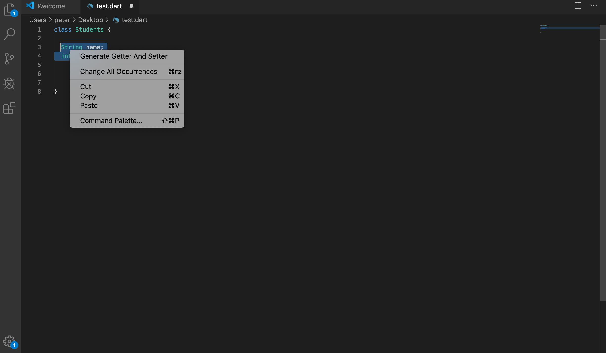

# Dart Getters And Setters
## Automatically Generate Getters And Setters
-------------------

[](https://marketplace.visualstudio.com/items?itemName=PeterHdd.dartgettersetter)
[](https://marketplace.visualstudio.com/items?itemName=PeterHdd.dartgettersetter)


## Installation

You can either install it from vscode or from the following link:

https://marketplace.visualstudio.com/items?itemName=PeterHdd.dartgettersetter

## Information

This vscode extension will automatically create the getters and setters for the fields in the dart file.

## Usage

Select the fields you want, right click and click on *Generate Getter And Setter*:



```
String _name;
int _age;

 String get name => _name;

 set name(String value) => _name = value;

 int get age => _age;

 set age(int value) => _age = value;
 ```